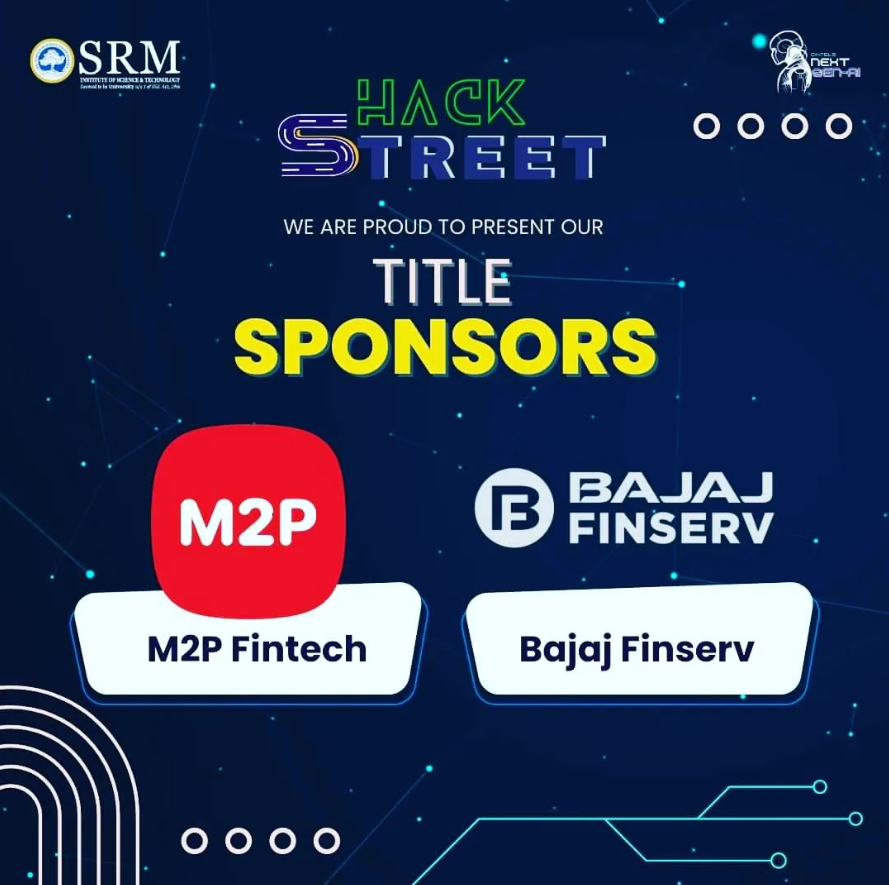
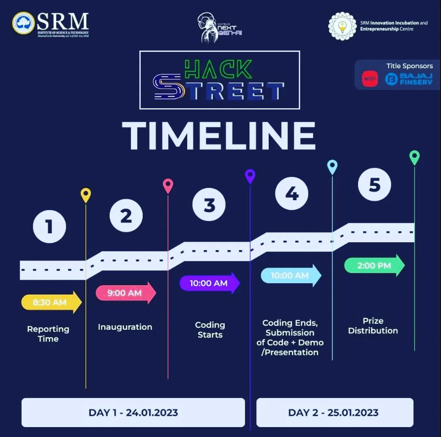
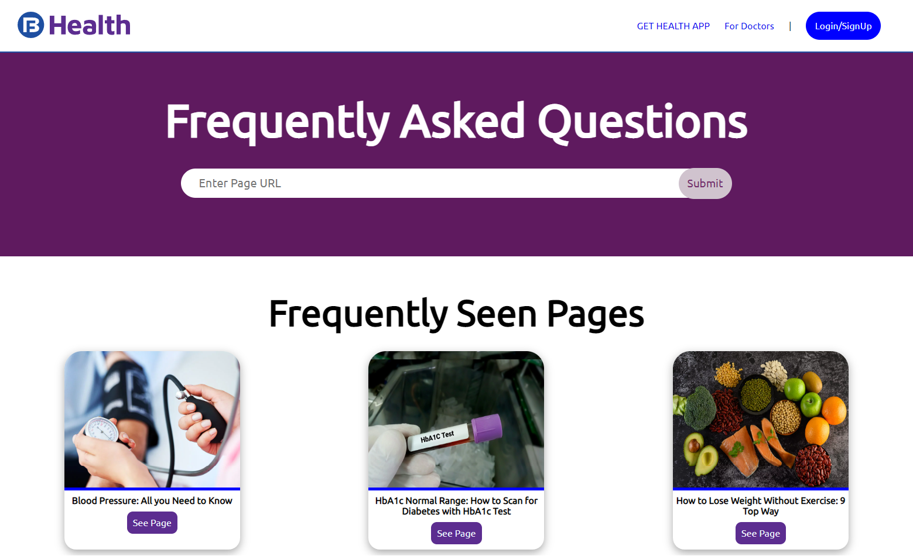

# WINNER 1st

## HackStreet - Hackathon

“Hackathons are where your wildest ideas become reality” – Alex Kern.

CINTEL’S NEXT-GEN AI presents HACK STREET, a 24-hour long Hackathon, from 24th-25th January 2023.

### Problem Statement

Generate health question and answers from 1000+ articles of Bajajfinservhealth.in
Approach: You are expected to read through content from our website and generate question and answers. You can also generate question and answers for the most common questions asked about a particular health topic.
Example : https://www.bajajfinservhealth.in/articles/gut-health
You should be able to generate question and answers based on the content and can also generate most common questions around the topic.

### Hackathon Timeline

Poster          |  Timeline
:-------------------------:|:-------------------------:
 |   

## Repo Status ✳️

<div align="center">
 
	
	
	
 
<br>
	
	
	
	
</div><br>

## Made On

[](https://forthebadge.com)
[](https://forthebadge.com)

## Website

https://hackstreet-hackathon.vercel.app - All features Are Not Available Due To Limited Computation Capacity - This is Just The UI.

## Full Project Download Link

Download The Project Zip File From : https://www.dropbox.com/scl/fo/vj5jx3i740a2dsveau4x8/h?dl=0&rlkey=jd590wxe3ygtqguy455odsd4x

## Installation

Install required modules with pip

```bash
  pip install -r requirements.txt

```

## API Reference

#### To Generate Question For A Url

```http
  GET /blog/<URL:string>

  example:
  /blog/https://www.bajajfinservhealth.in/articles/ayurvedic-medicine-for-high-bp
```

#### To Generate Question For A Url in JSON Format

```http
  GET /api/<URL:string>

  example:
  /api/https://www.bajajfinservhealth.in/articles/ayurvedic-medicine-for-high-bp
```

## Acknowledgements

- [QuestGen](https://www.questgen.ai)

Questgen AI is an opensource NLP library focused on developing easy to use Question generation algorithms.
It is on a quest build the world's most advanced question generation AI leveraging on state-of-the-art transformer models like T5, BERT and OpenAI GPT-2 etc.

## [ Original QuestGen AI Model ]

[](https://colab.research.google.com/drive/1CvgSjU48kN5jEtCU732soM723W1spGdm?usp=sharing)

## Screenshots




# WINNERS


## Our Contributors ✨

<a href="https://github.com/Yash-Parsana/CrazyCoderApp/graphs/contributors">
  
</a> 
<br><br>
Thank you to all the amazing contributors who have made this project possible!!💝

## 🔗 Links

portfolio                          |  linkedin           | Instagram
:-------------------------:|:-------------------------:|:-------------------------:
[](https://bishalde.vercel.app) | [](https://www.linkedin.com/in/bishalde/) |[](https://instagram.com/bishal_de/)

## Give A Bow